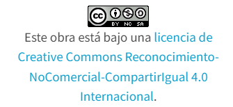

# Proxmox: Automatizar un entorno de trabajo.
## Descripción

La idea de este proyecto es automatizar un entorno de trabajo real.

Estamos en un centro educativo y necesitamos:

- Crear grupos de trabajo para alumnos.

- Crear usuarios y asignarles un determinado grupo.

- Crear pools: uno para cada alumno(Proyecto.NombreAlumno) y uno común para guardar las plantillas (imagenes).

- Crear nuevos roles.

- Asignar a usuarios o a grupos, permisos (roles) sobre los pools creados anteriormente.

- Poner a disposición de los usuarios plantillas de contenedores y máquinas virtuales.

La información estará guardada en un fichero llamado **usuarios.txt** .

Ese fichero puede ser lo complejo que se necesite. Para simplificarlo hemos supuesto que dicho fichero solo tiene dos campos:

nombre de usuario: contraseña

alumno01:contra01

alumno02:contra02

Veremos los comandos necesarios para automatizar el proceso.

Espero que alguién le pueda servir.

## Contenidos
1. Conociendo el Clúster

  - [Conociendo el Clúster](modulo1/cluster.md)

2. Gestión de usuarios y grupos

  - [Gestión de usarios y grupos](modulo2/usuariosygrupos.md)

  3. Creación de pools

 - [Gestión de pools](modulo3/gestionpools.md)
 

4. Almacenamiento
  - [Gestion de almacenamiento](modulo4/gestionalmacenamiento.md)
 
5. Roles y permisos
  - [Gestion de roles](modulo5/gestionroles.md)

6. Script completo
  - [Script completo](modulo6/creacionentorno.md)
  - [Vídeo script](Falta el enlace)

7.- Plantillas
- [Gestion de plantillas](modulo7/gestionplantillas.md)
## Referencias
  * [José Domingo Muñoz](https://plataforma.josedomingo.org/pledin/)
  * [proxmox](https://pve.proxmox.com/pve-docs/api-viewer)

## Licencia

