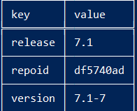
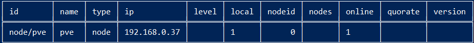
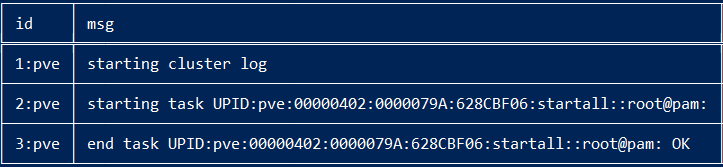
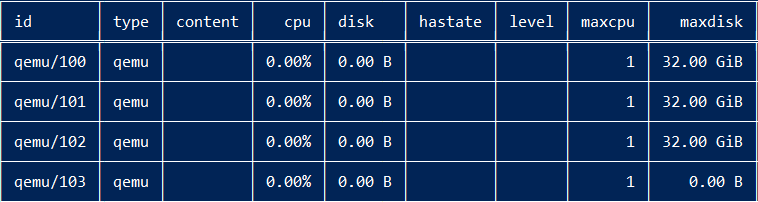
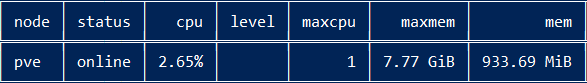

# Conociendo el Clúster

## Versión de Proxmox.
`pvesh get /version`

## Información del estado del clúster.
`pvesh get /cluster/status`

## Información de los logs
`pvesh get /cluster/log`

## Nos muestra los recursos del clúster.
`pvesh get /cluster/resources`

## Nos muestra las máquinas virtuales.
`pvesh get /cluster/resources --type vm `

## Nos muestra el almacenamiento.
`pvesh get /storage`

## Nos muestra los pools existentes.
`pvesh get pools`

## Nos muestra información de los nodos.
`pvesh get /nodes `

