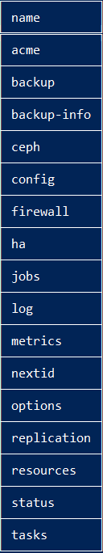

# Conociendo el Clúster

## Muestra el menú asociado al Clúster
`pvesh get /cluster`

## Nos muestra los recursos del clúster
`pvesh get /cluster/resources`

## Nos muestra el almacenamiento
`pvesh get /storage`

## Nos muestra los pools existentes
`pvesh get pools`

