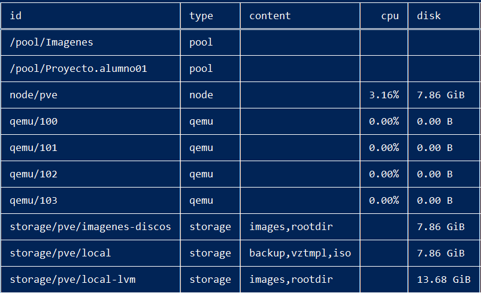
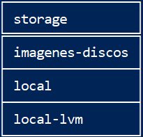
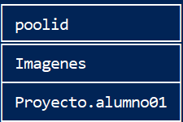

# Recursos del Clúster

## Nos muestra todos los recursos y pools del clúster
`pvesh get /cluster/resources`

## Nos muestra el almacenamiento
`pvesh get /storage`

## Nos muestra los pools existentes
`pvesh get pools`

