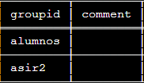
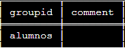
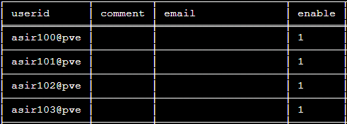
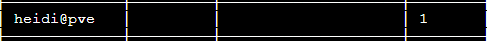
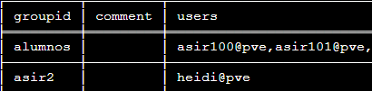

# Usuarios y grupos 

##  Información de los grupos

`pvesh get /access/groups`

## Crear un grupo

`pvesh create /access/groups --groupid asir2`

## Eliminar un grupo

`pvesh delete /access/groups/asir2`

## Información de los usuarios

`pvesh get /access/users`

## Crear un usuario con contraseña 
`pvesh create /access/users --userid heidi@pve --password "heidi"`

pve: Representa el ámbito: Proxmox VE authentication server

## Borrar un usuario
`pvesh delete /access/users/heidi@pve`

## Añadir un usuario a un grupo

#### Creamos el grupo: asir2
`pvesh create /access/groups --groupid asir2`

#### Creamos el usuario: heidi
`pvesh create /access/users --userid heidi@pve --password "heidi"`

#### Añadimos el usuario a dicho grupo
`pvesh set /access/users/heidi@pve --groups asir2`

#### Quitar un usuario de un grupo

