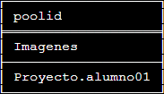
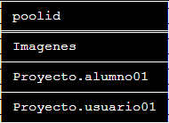

# Creación de Pools

#### Nos muestra los pools existentes

`pvesh get pools`

#### Creación de un pools

`pvesh create /pools -poolid "Proyecto.usuario01"`

 `pvesh get pools`

#### Borrar un pool

 `pvesh delete /pools/Proyecto.usuario01`
 
 
 
 Solo podemos borrar los pools vacíos.
