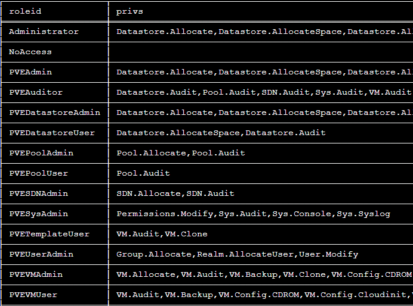
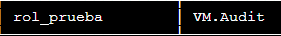

# Gestión de permisos

#### Visualizamos los roles existentes

` pvesh get /access/roles/`



### Algunos permisos
```
Datastore.AllocateSpace
Datastore.Audit
Permissions.Modify
Pool.Audit
Sys.Audit
Sys.Console
Sys.Modify
Sys.Syslog
VM.Allocate
VM.Audit
VM.Backup
VM.Clone
VM.Config.CDROM
VM.Config.CPU
VM.Config.Cloudinit
VM.Config.Disk
VM.Config.HWType
VM.Config.Memory
VM.Config.Network
VM.Config.Options
VM.Console
VM.Migrate
VM.Monitor
VM.PowerMgmt
VM.Snapshot
VM.Snapshot.Rollback
```


#### Crear un rol y añadir permisos

`pvesh create /access/roles --roleid rol_prueba --privs VM.Audit`

`pvesh get /access/roles/`




#### Eliminar un rol

`pvesh delete /access/roles/rol_prueba`
